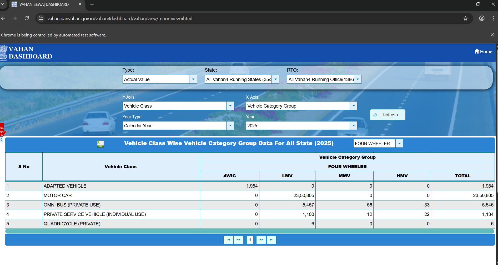
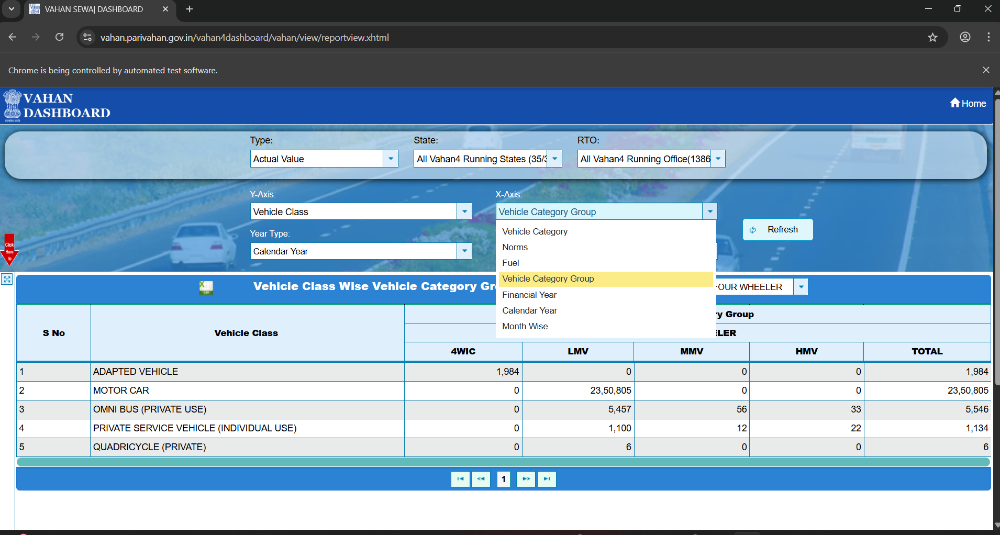
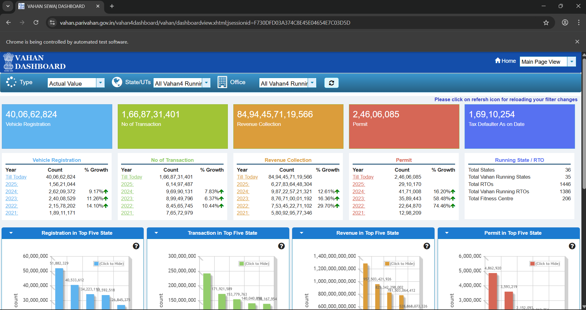

Got it, Pallavi — I’ll make you a **professional, HR-ready `README.md`** that matches your assignment requirements.

Here’s a draft you can put directly into your GitHub repo:

---

# Vahan Dashboard

## 📌 Project Overview

The **Vahan Dashboard** is an interactive data visualization tool that automates the scraping and processing of vehicle registration data from the [Vahan portal](https://vahan.parivahan.gov.in/).
Built with **Python** and **Streamlit**, it allows users to filter, analyze, and download vehicle registration insights — with a focus on trends important to investors.

---

## 🚀 Features

* **Automated Data Update**

  * One-click script to scrape and process the latest data
* **Interactive Dashboard**

  * Filters by **date range**, **vehicle category**, and **manufacturer**
* **Investor Metrics**

  * Year-over-Year (YoY) and Quarter-over-Quarter (QoQ) growth
* **Data Export**

  * Download filtered results as CSV
* **Visualizations**

  * Line & bar charts for trends
  * Percentage change indicators

---

## 🛠️ Tech Stack

* **Python** — Data processing & automation
* **Selenium** — Web scraping
* **Pandas** — Data manipulation
* **Streamlit** — Interactive UI
* **Matplotlib/Plotly** — Visualizations
* **Git** — Version control

---

## 📂 Project Structure

```
vahan_dashboard/
├── data/                 # Raw & processed data
├── src/                  # Source scripts
│   ├── scrape_vahan.py   # Web scraper
│   ├── process_data.py   # Data processing logic
│   ├── update_data.py    # Automation script
│   └── app.py            # Streamlit dashboard
├── requirements.txt      # Project dependencies
└── README.md             # Project documentation
```

---

## ⚙️ Setup Instructions

1. **Clone the repository**

   ```bash
   git clone https://github.com/Pallavi191203/vahan_dashboard.git
   cd vahan_dashboard
   ```

2. **Create & activate virtual environment** (Windows)

   ```bash
   python -m venv venv
   venv\Scripts\activate
   ```

3. **Install dependencies**

   ```bash
   pip install -r requirements.txt
   ```

4. **Run the dashboard**

   ```bash
   streamlit run src/app.py
   ```

5. **Update data manually**

   ```bash
   python src/update_data.py
   ```

---

## 📊 Data Assumptions

* Data is sourced from the official **Vahan dashboard**.
* Missing data for certain states/UTs is assumed unavailable rather than zero.
* YoY and QoQ growth calculations are based on available data points only.

---

## 📅 Feature Roadmap

* [ ] Deploy as a hosted dashboard
* [ ] Add state-level breakdown
* [ ] Email alerts for unusual growth patterns
* [ ] AI-powered anomaly detection

---

## 📽️ Video Walkthrough

[Click here to watch the demo](#)

---

## 💡 Key Insights

* 2W category consistently dominates new registrations across multiple states.
* Significant QoQ spikes in EV registrations observed in certain metros — potential for EV-focused investments.
## 📷 Screenshots

### Dashboard Overview


### Filters in Action


### Charts

